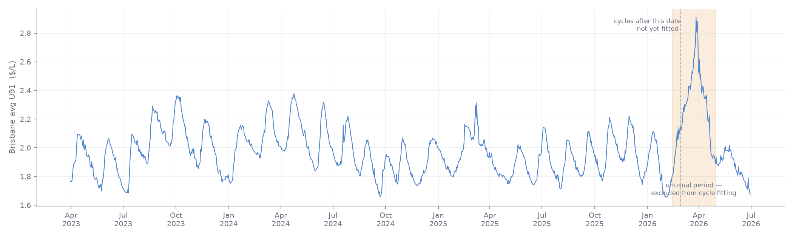
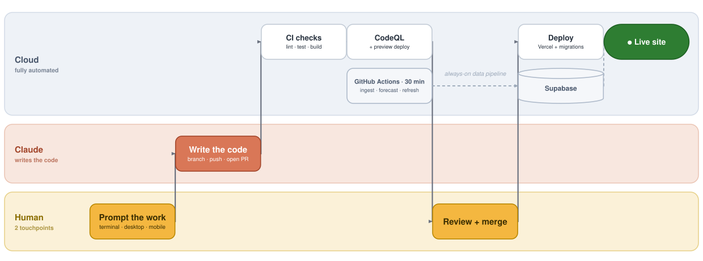

# Brisbane Bowser Beater

A single-page web app for Brisbane drivers. It combines live fuel-price data
with an AI fuel strategist to help you time your fills around Brisbane's
recurring retail fuel-price cycle.

**Live site:** [brisbane-bowser-beater.vercel.app](https://brisbane-bowser-beater.vercel.app)

> **General information only.** Fuel prices and forecasts are estimates —
> verify before you fill.

---

## The Brisbane fuel cycle

Retail petrol prices in Australia's major capital cities move in **recurring
cycles** — prices climb to a peak, then ease back down to a trough, over and
over. The ACCC studies and publishes regular
[fuel-price monitoring reports](https://www.accc.gov.au/by-industry/petrol-and-fuel/fuel-and-petrol-monitoring)
on these cycles, which are not closely correlated with wholesale price
movements. For a driver, the practical upshot is simple: **when you fill can
matter as much as where.**

Here's three years of the Brisbane-area daily average — the pattern needs no
explaining:



*Data: QLD Fuel Price Reporting, [data.qld.gov.au](https://www.data.qld.gov.au)
(CC BY 4.0).*

This app focuses on **Brisbane Metro U91**. From that same ~3 years of
Queensland open-data price reporting, the current Brisbane cycle is observed
to:

- run **~39 days** trough-to-trough (recent cycles have ranged ~31–46 days),
- swing **~$0.35/L** from trough to peak,
- be **asymmetric** — the climb to the peak takes ~38% of the cycle, the easing
  back down ~62% (prices tend to rise faster than they fall).

These are observations of the price series, framed as estimates — not
predictions you should bank on, and not claims about why anyone prices the way
they do.

## What the app does

**One page, two parts:**

1. **A chart — "When to fill up."** The Brisbane-area **average** U91 price:
   recent history plus a ~30-day forward **forecast** with an uncertainty band. A
   single line — never per-station prices. Below it, a plain-language explanation
   of the cycle and a daily one-line summary ("Brisbane U91 is easing off its
   peak; next trough ~3 Jun…").
2. **An AI fuel strategist.** Pick a starter chip that matches your situation
   (how often you fill × how much flexibility you have) and it produces a
   concrete, dated fill plan — best-effort on sensible defaults first, then
   refined if you tell it more (tank size, weekly km, current level, etc.). It
   reasons over the same forecast the chart shows.

There's also a small **"Shout me a litre"** tip jar — Stripe-hosted Checkout,
fuel-themed amounts, and a strict no-donor-data posture (see
[Privacy](#privacy)).

## From prompt to production

This repo is built through an AI-assisted workflow where the human is hands-on at
exactly **two** points: **prompt** the work, and **review + merge** it. Everything
in between — writing the code, branching, pushing, opening the pull request,
passing the automated checks, and shipping to production — runs through Claude and
the cloud. The swimlanes below make the split obvious: the **Human** lane holds
just two touchpoints, while **Claude** and **Cloud** carry the rest.



The dashed **always-on data pipeline** runs on its own schedule, independent of
any code change — see [Architecture](#architecture) for what each job does. The
diagram is generated from [`docs/workflow-diagram.py`](docs/workflow-diagram.py)
(pure stdlib; `python3 docs/workflow-diagram.py` regenerates the SVG).

## How the forecast works

The forecast is **deterministic** (no AI) and built in three stages:

1. **Characterise the cycle (offline, one-time).** Python scripts in
   [`/analysis`](analysis) pull ~3 years of Queensland open-data CSVs, detect
   troughs and peaks, exclude outlier cycles, and distil a *canonical cycle
   shape* (period, amplitude, asymmetry, and a per-phase spread). The result is a
   single committed artifact,
   [`analysis/output/cycle_params.json`](analysis/output/cycle_params.json) — the
   contract between the analysis and the production code.
2. **Project forward daily (live).** A daily job reads that template, finds where
   the **most recent observed prices** sit in the cycle (a least-squares phase
   fit), and projects the canonical shape ~30 days ahead, anchored to today's
   price. It fits only against genuinely-varying recent data, so flat gaps in the
   feed can't distort it.
3. **Re-fit occasionally (~quarterly).** One command —
   `analysis/.venv/bin/python analysis/refresh_all.py` (after
   `download_data.py`) — regenerates the template **and** every committed
   visual/data artifact together, so a partial refresh can't slip through
   (and a test fails the build if it somehow does). One manual step remains:
   re-authoring the hand-written `anomaly_notes` block in
   `cycle_params.json`; the script prints a reminder.

The model itself is easiest to see, not describe: every fitted cycle
overlaid on a common phase axis, with the canonical template — the exact
`shape` array committed in `cycle_params.json` — drawn bold on top. Not a
formula; just the recency-weighted average shape of observed cycles.


The faint per-cycle rows live in
[`analysis/output/cycle_shapes.json`](analysis/output/cycle_shapes.json) and are
regenerated pinned to the committed fit's data window, with the cycle count
asserted against `cycle_params.json` — a consistency test fails the build if
the two artifacts ever describe different fits.

**The uncertainty band** comes from how much past cycles have varied at each
point in the cycle:

> Best guess in the middle. The band shows the range past cycles have moved
> within — actual prices usually land somewhere inside it.

## Data source

Price data comes from the **Queensland Government Fuel Price Reporting** scheme:

- **Live prices** via the QLD Fuel Price Reporting API (we are registered as a
  *publisher* under its Licensed-User Licence). Polled every 30 minutes,
  aggregated to a single Brisbane-area average, and displayed in aggregate only.
- **Historical backfill** from the QLD open-data CSVs
  ([data.qld.gov.au](https://www.data.qld.gov.au/dataset/fuel-price-reporting-2026)),
  licensed **CC BY 4.0**.

"Brisbane" here means core Brisbane Metro — QLD postcodes 4000–4179. The app's
`/about/data` page carries the verbatim attribution notices the publisher
licence requires.

## Architecture

| Layer | Choice |
|---|---|
| Framework | Next.js 16 (App Router, RSC) + React 19 + TypeScript (strict) |
| UI / charts | Tailwind v4 + Recharts |
| Database | Supabase (Postgres) — aggregate display tables, RLS-protected |
| AI | Vercel AI SDK v6 + Anthropic Claude (agent only) |
| Data pipeline | GitHub Actions (30-min ingest, weekly site refresh, daily forecast + narrative) → Supabase |
| Hosting | Vercel |

The data pipeline runs entirely on **GitHub Actions** writing straight to
Supabase, keeping the polling off the hosting tier. The web app is pure
TypeScript; the Python analysis never runs on the server.

### MCP server

The same public forecast data is also served to AI clients through a small
read-only **[MCP server](mcp/README.md)** (`mcp/` + `infra/`): an AWS
Lambda behind an auth-gated API Gateway endpoint, defined as a single
Terraform stack and deployed exclusively via GitHub Actions OIDC, so no
long-lived AWS credentials exist anywhere. Five tools.

Three serve the forecast data directly: the live forecast, recent observed
history, and the fitted cycle model.

The other two — `search_docs` and `ask_docs` — answer questions about the
project itself from its own documentation, using **retrieval-augmented
generation built on Amazon Bedrock**: a Bedrock Knowledge Base over an
[S3 Vectors](https://docs.aws.amazon.com/AmazonS3/latest/userguide/s3-vectors.html)
index, Titan Text Embeddings V2 for indexing, and Claude Haiku 4.5 for
generation through the `au.` geographic inference profile. `search_docs`
returns matching passages with their sources; `ask_docs` returns a grounded
answer with citations back to the files it came from. The corpus is a
curated allowlist of this repo's public docs, not a glob — internal working
notes are excluded, and a test enforces that.

Generation is the only paid call anywhere in the project, so it sits behind
layered guards that AWS itself enforces rather than the code: a monthly
request quota on the API key, per-request caps (input length, retrieved
chunks, output tokens, single attempt with no retries), and a budget action
that attaches a `Deny bedrock:*` policy to the server role at 100% of a USD 5
budget. Every IAM role in the stack also carries a permissions boundary it
cannot widen. Design notes are in
[`docs/mcp-rag-design.md`](docs/mcp-rag-design.md); the full security posture
is in [`mcp/README.md`](mcp/README.md).

**Try it.** The endpoint is public; calls need an API key, available on
request. With one, point any MCP client at it:

```bash
claude mcp add --transport http bbb https://13op7uo7ch.execute-api.ap-southeast-2.amazonaws.com/prod/mcp \
  --header "x-api-key: <key>"
```

Then ask your assistant something like *"using the bbb tools, where is
Brisbane in its fuel price cycle right now?"* or *"ask the bbb docs how the
forecast handles uncertainty"*. Without a key the endpoint returns 403, so
the URL alone is safe to publish. Get in touch if you would like a key.

### Cost & operational safety

The app is built to be cheap to run and safe to leave unattended:

- **Hard spend cap** on the Anthropic key, plus per-IP rate limiting, aggressive
  caching, and per-call token/step caps — so the only paid surface (the agent)
  can't run away. See [`docs/abuse-audit.md`](docs/abuse-audit.md).
- **Self-policing on stale data:** if the latest ingestion is older than 60
  minutes, the app shows a "temporarily unavailable" page instead of stale
  licensed data — no human needed.
- **Kill switch:** a single env var (`BBB_PUBLIC`) flips the whole site to a
  paused page for instant takedown.

### Privacy

No accounts, no login, no cookies that follow you around, no client-side
analytics. The planner conversation goes to Anthropic to generate your plan and
isn't stored on our side; repeatable results are cached against a **hash** of
the inputs, not the inputs themselves. It's all open source — read the code.

**Tips ("Shout me a litre"):** payments run through Stripe-hosted Checkout, so
card details never touch this site. Deliberately, **no donor PII ever enters
our database** — donor identity's system of record is Stripe (that's their
regulated job). Our reconciliation ledger records only opaque Stripe IDs
(event, checkout session, payment intent), the amount, currency, status, and
timestamps, each row backed by a signature-verified webhook event. The ledger
has no public read access. The practical upshot: a breach of our database
would expose no donor identities, because they were never here.

## Local development

```bash
npm install
cp .env.local.example .env.local   # fill in Supabase (+ optional Anthropic) values
npm run verify:supabase            # check connectivity (never prints keys)
npm run dev
```

Useful scripts:

| Script | What |
|---|---|
| `npm run backfill:csv` | Import the QLD open-data CSVs into `price_snapshots` |
| `npm run ingest:prices` | One live price ingest (Brisbane U91) |
| `npm run refresh:sites` | Refresh station metadata |
| `npm run forecast:generate` | Generate the forecast + daily narrative (`--dry` to preview) |

The ingest/forecast jobs also run on schedule via
[`.github/workflows`](.github/workflows).

## Roadmap

Deliberately out of MVP scope, tracked for later:

- Per-station "where to fill right now" view (cut to limit publisher-licence
  exposure; the cycle + planner carry the value).
- User-selectable fuel types and regions beyond Brisbane Metro U91.
- "On the move" push notifications (the long-term killer feature — needs a
  mobile/PWA rebuild).
- Browser geolocation, map UI, accounts/favourites.

## Legal

General information only; fuel prices and forecasts are estimates — verify
before you fill. Data © the State of Queensland (Fuel Price Reporting);
historical CSVs licensed CC BY 4.0. This project is an independent tool and is
not affiliated with or endorsed by the Queensland Government, the ACCC, or any
fuel retailer.
